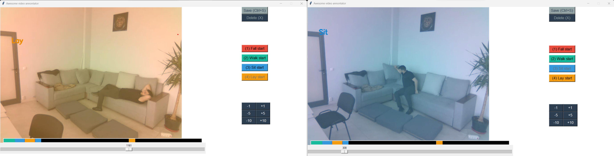

# Action Annotator

    

    

Video Activity Tracker and Annotation Tool designed for tracking and annotating human activities in videos. With this tool, users can effortlessly load a video and label human activities, such as:
* falling,
* walking,
* sitting,
* laying.
